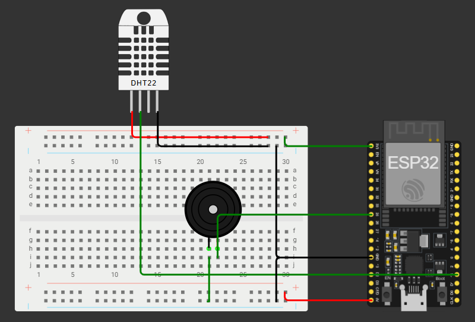

# Sistem Alarm Indikasi Kebakaran Berbasis IoT (ESP32 & DHT22)

## Deskripsi Proyek
Proyek ini adalah sistem alarm indikasi kebakaran berbasis *Internet of Things* (IoT) yang berfungsi sebagai solusi preventif peringatan dini. Sistem ini memantau suhu dan kelembapan ruangan secara *real-time* menggunakan sensor DHT22 dan mikrokontroler ESP32 DevKit V1. Jika suhu lingkungan menyentuh ambang batas kritis (≥ 45°C), sistem akan secara otomatis membunyikan Buzzer di lokasi dan mengirimkan *push notification* berstatus "BAHAYA" ke *smartphone* pengguna melalui platform Blynk.

Proyek ini disusun untuk memenuhi tugas akhir mata kuliah Internet of Things di Program Studi Teknologi Informasi, Fakultas Teknik & Informatika, Universitas Bina Sarana Informatika (UBSI).

## Fitur Utama
* **Pemantauan Real-Time**: Visualisasi data suhu dan kelembapan secara langsung melalui antarmuka aplikasi Blynk.
* **Peringatan Dini Lokal**: *Active Buzzer* bertindak sebagai alarm suara yang menyala otomatis jika suhu terdeteksi mencapai 45°C atau lebih.
* **Notifikasi Jarak Jauh**: Mengirimkan peringatan instan bertipe *Critical* ke aplikasi seluler saat kondisi bahaya melalui koneksi *hotspot smartphone*.
* **Visualisasi Data Historis**: Menyediakan *SuperChart* grafik fluktuasi suhu dan kelembapan untuk meninjau riwayat anomali suhu.

## Perangkat Keras (Hardware)
* ESP32 DevKit V1 (Mikrokontroler utama dengan modul WiFi terintegrasi)
* Sensor DHT22 (Sensor pengukur suhu dan kelembapan berpresisi tinggi)
* Active Buzzer (Aktuator keluaran peringatan suara)
* Breadboard & Kabel Jumper
* Kabel Micro USB & Adaptor 5V/2A

## Perangkat Lunak (Software)
* Visual Studio Code dengan *extension* PlatformIO
* Blynk IoT App (Mobile) & Blynk Cloud Dashboard (Web)
* **Library Pendukung**: Blynk Library, DHT Sensor Library, dan Adafruit Unified Sensor

## Skema Rangkaian (Wiring Diagram)
Perakitan perangkat keras menggunakan konsep *Common Ground*. Berikut adalah konfigurasi pemetaan pin mikrokontroler yang digunakan:

| Komponen | Pin Komponen | Pin ESP32 (GPIO) | Keterangan |
| :--- | :--- | :--- | :--- |
| **Sensor DHT22** | Positif (+) | 3.3V | Suplai daya sensor |
| | Out / Data | GPIO 15 | Jalur pengiriman data digital hasil pembacaan suhu |
| | GND | GND | Jalur negatif bersama |
| **Active Buzzer**| Positif (+) | GPIO 25 | Memberikan sinyal *High* saat alarm aktif |
| | Negatif (-) | GND | Jalur negatif bersama |

## Cara Penggunaan / Instalasi
1. Lakukan *Clone* repositori ini ke penyimpanan lokal Anda.
2. Buka folder proyek menggunakan **Visual Studio Code**. Pastikan ekstensi **PlatformIO** sudah terpasang.
3. Lakukan konfigurasi kredensial pada file `main.cpp`:
   * Masukkan kode `BLYNK_AUTH_TOKEN` yang Anda dapatkan dari pembuatan *Template* di Blynk Dashboard.
   * Sesuaikan variabel `ssid` dan `password` dengan jaringan *Hotspot* WiFi yang Anda gunakan.
4. Hubungkan ESP32 ke port USB komputer/laptop menggunakan kabel Micro USB.
5. Lakukan proses *Build* dan *Upload* program ke mikrokontroler ESP32 menggunakan fitur di PlatformIO.
6. Buka *Serial Monitor* (pada *baud rate* 115200) untuk memantau status perangkat terhubung ke WiFi dan server Blynk.

## Tim Pengembang
* Muhammad Amir Syarifuddin (17230462)
* Aditiya Saputra (17230476)
* Dita Rhevinda Putri (17230440)
* Idris Haidir Ali (17230172)
* Nabillah April Riyanti (17230631)